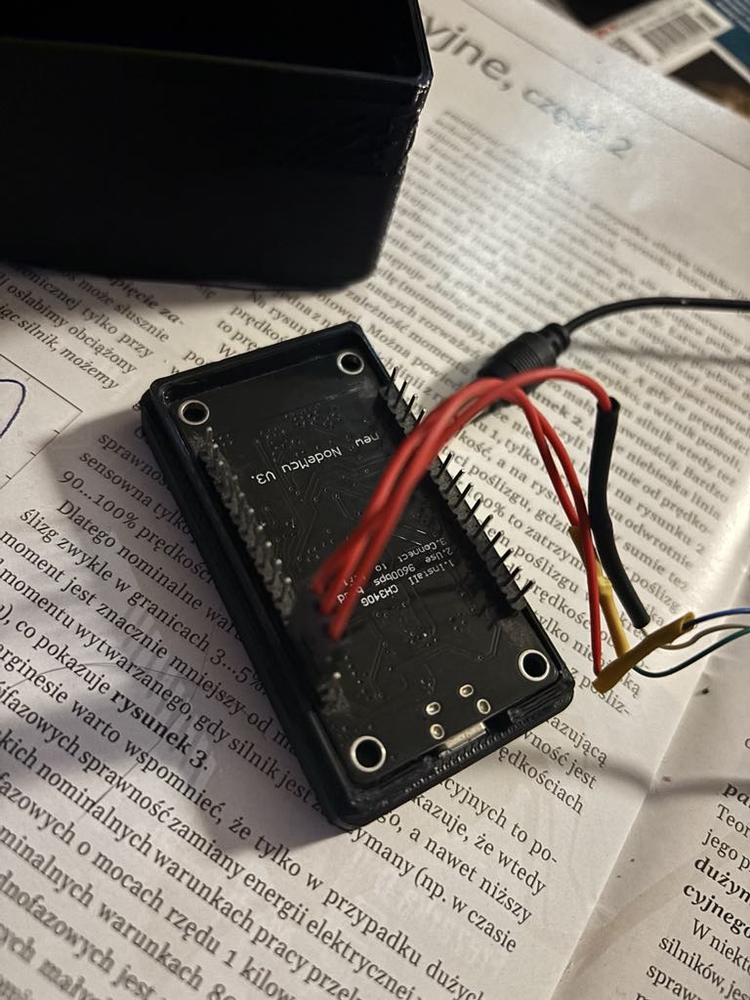

Aby zapewnić komunikację między mikrokontrolerem ESP8266 a kalkulatorem Texas Instruments TI-85, musimy rozważyć kilka kwestii technicznych. TI-85 używa portu szeregowego (RS232) do komunikacji z komputerem, dlatego konieczne będzie podłączenie tego portu do mikrokontrolera ESP8266. Za pomocą tego portu będziemy mogli przesyłać dane między kalkulatorem a komputerem, z wykorzystaniem ESP8266 jako interfejsu.

**Założenia**

1. **Komunikacja za pomocą RS232**: TI-85 wykorzystuje standard RS232 do komunikacji szeregowej z komputerem.
1. **Interfejs UART w ESP8266**: ESP8266 ma możliwość komunikacji UART (Universal Asynchronous Receiver/Transmitter), która jest kompatybilna z RS232 przy odpowiednich poziomach napięć.
1. **Przesyłanie danych**: Będziemy odczytywać dane z kalkulatora, a następnie wyświetlać je na komputerze za pomocą połączenia WiFi.

**Co będzie nam potrzebne:**

- **ESP8266**: Mikrokontroler z wbudowanym WiFi, który będzie pełnił funkcję pośrednika w komunikacji.
- **Moduł konwersji RS232 na TTL** (np. MAX232) – ponieważ ESP8266 używa poziomów napięć TTL (0V/3.3V), a TI-85 używa poziomów RS232 (-12V do +12V).
- **Kabel szeregowy RS232** – do podłączenia TI-85 do konwertera.
- **Połączenie WiFi** – do przesyłania danych do komputera lub aplikacji na komputerze.

**Podłączenie:**

1. **ESP8266 i konwerter RS232 do TTL**:
- Konwerter RS232 (MAX232) ma dwa główne piny: **`TX`** (transmisja) i **`RX`** (odbiór).
- Pin **`TX`** konwertera podłączymy do pinu **`RX`** ESP8266.
- Pin **`RX`** konwertera podłączymy do pinu **`TX`** ESP8266.
- GND konwertera podłączamy do GND ESP8266.
- Warto pamiętać, aby prawidłowo podłączyć napięcia, ponieważ ESP8266 działa na 3.3V, a RS232 używa napięć, które wymagają konwersji.
2. **TI-85 i konwerter RS232 do TTL**:
- Podłączamy port szeregowy TI-85 (często DB9) do wejścia konwertera RS232 do TTL.
- W tym przypadku interesują nas linie TX i RX, a także masa (GND).
3. **ESP8266 i komputer**:
- ESP8266 będzie pełnił rolę mostu WiFi, przesyłając dane z TI-85 na komputer (np. za pomocą WebSocketów, HTTP lub MQTT).

**Przykładowy kod na ESP8266 (Arduino IDE)**

Ten kod zakłada, że będziemy przesyłać dane z TI-85 na komputer przez ESP8266. Korzystamy z komunikacji szeregowej (UART) pomiędzy ESP8266 a kalkulatorem, a następnie przesyłamy dane przez WiFi (np. do aplikacji webowej na komputerze).

```


#include <ESP8266WiFi.h>

const char\* ssid = "Twoje\_SSID"; const char\* password = "Twoje\_Haslo"; WiFiServer server(80);

#define RX\_PIN 3   // Pin RX ESP8266 (D3) #define TX\_PIN 1   // Pin TX ESP8266 (D10)

HardwareSerial mySerial(1);  // Używamy hardware serial portu 1 w ESP8266

void setup() {

`  `Serial.begin(115200);  // Komunikacja z komputerem

`  `mySerial.begin(9600, SERIAL\_8N1, RX\_PIN, TX\_PIN);  // Komunikacja z TI-85 (prędkość 9600 b ps)

`  `WiFi.begin(ssid, password);

`  `while (WiFi.status() != WL\_CONNECTED) {

delay(500);

Serial.print(".");

`  `}

`  `Serial.println("Połączono z WiFi");

`  `server.begin();

}

void loop() {

`  `WiFiClient client = server.available();

`  `if (client) {

Serial.println("Nowe połączenie");

while (client.connected()) {

if (mySerial.available()) {

char data = mySerial.read();  // Odczytujemy dane z TI-85

client.write(data);  // Przesyłamy dane do klienta

Serial.print(data);  // Wypisujemy dane na monitorze szeregowym }

}

client.stop();

Serial.println("Połączenie zakończone");

`  `}

`  `// Przesyłanie danych z komputera do TI-85

`  `if (Serial.available()) {

char data = Serial.read();  // Odczytujemy dane z portu szeregowego mySerial.write(data);  // Wysyłamy dane do TI-85

`  `}

}
```
**Opis działania:**

1. **WiFi**: Kod łączy się z siecią WiFi, używając podanych danych SSID i hasła.
1. **Komunikacja szeregowa**:
- **mySerial** to instancja portu szeregowego, którą używamy do komunikacji z TI-85. Odczytujemy dane z TI-85, a następnie wysyłamy je do klienta (np. przeglądarki internetowej).
  - **Serial** jest używany do komunikacji z komputerem, umożliwiając np. wysyłanie komend do TI- 85.
3. **Serwer HTTP**: Uruchamiamy prosty serwer HTTP na porcie 80, który czeka na połączenie klienta (np. przeglądarki internetowej).
3. **Przesyłanie danych**: Po nawiązaniu połączenia z klientem, ESP8266 odbiera dane z TI-85 i wysyła je do klienta przez WiFi. Dane mogą być wyświetlane na stronie internetowej lub odbierane przez aplikację na komputerze.

**Podsumowanie:**

- **HardwareSerial mySerial** umożliwia komunikację pomiędzy ESP8266 a TI-85 przez UART.
- **WiFiClient** pozwala na przesyłanie danych do komputera przez WiFi, co umożliwia wizualizację danych z TI-85.
- Wykorzystanie serwera HTTP w ESP8266 umożliwia łatwe odbieranie danych na komputerze za pomocą przeglądarki.

Powyższy kod jest podstawą, którą można rozbudować o dodatkowe funkcjonalności, takie jak obsługa plików czy zaawansowana interakcja z kalkulatorem TI-85.


Aby odczytać dane z kalkulatora **TI-85** na komputerze, trzeba stworzyć odpowiednią aplikację lub skorzystać z gotowego rozwiązania, które umożliwi komunikację przez port szeregowy z urządzeniem. Poniżej przedstawię dwie główne metody:

1. **Korzystanie z terminala szeregowego (np. PuTTY)**
1. **Napisanie prostego programu w Pythonie do odczytu danych z kalkulatora**

Obie metody mogą korzystać z komunikacji, którą zapewnia **ESP8266** jako pośrednik w komunikacji pomiędzy kalkulatorem TI-85 a komputerem (poprzez WiFi).

**1. Odczyt danych za pomocą terminala szeregowego (np. PuTTY)**

Jeśli chcesz po prostu odczytać dane z kalkulatora na komputerze bez pisania własnych aplikacji, najprostszym rozwiązaniem jest użycie **PuTTY** lub **Tera Term**, które umożliwiają połączenie z portem szeregowym przez WiFi (ESP8266 działa jako most komunikacyjny).

**Kroki:**

1. **Zainstaluj PuTTY lub Tera Term**:
   1. [Pobierz PuTTY](https://www.putty.org/) lub Pobierz Tera Term.
1. **Skonfiguruj połączenie WiFi z ESP8266**:
- Upewnij się, że ESP8266 jest poprawnie skonfigurowany i podłączony do sieci WiFi. Przesyła dane z TI-85 do komputera przez WiFi, jak w poprzednim przykładzie.
3. **Skonfiguruj PuTTY/Tera Term do połączenia przez port szeregowy**:
- **Adres IP ESP8266**: Otwórz PuTTY i ustaw adres IP ESP8266 oraz port (domyślnie port 80, jeśli używasz HTTP).
- Możesz także skonfigurować PuTTY, aby łączyło się z portem szeregowym bezpośrednio, jeżeli masz bezpośrednie połączenie z kalkulatorem TI-85 przez konwerter USB-RS232.
4. **Otwórz połączenie**:
- Po nawiązaniu połączenia z ESP8266 (lub bezpośrednio z urządzeniem), PuTTY/Tera Term powinno zacząć odbierać dane z kalkulatora i wyświetlać je na ekranie komputera.

**2. Odczyt danych za pomocą programu w Pythonie**

Jeśli chcesz stworzyć własne oprogramowanie do odczytu danych z kalkulatora TI-85 przez ESP8266, najlepszym rozwiązaniem będzie użycie **Pythona** i biblioteki do obsługi komunikacji szeregowej, takiej jak **pySerial**.

**Kroki:**

1. **Zainstaluj Python i bibliotekę pySerial**:
- Jeśli nie masz jeszcze zainstalowanego Pythona, pobierz go z [oficjalnej strony](https://www.python.org/downloads/).
- Zainstaluj bibliotekę **`pySerial`**, która umożliwia komunikację przez port szeregowy:


```
pip install pyserial
```
2. **Stwórz prosty program w Pythonie**:

   Poniżej znajduje się przykładowy skrypt w Pythonie, który odczytuje dane przesyłane przez port szeregowy z kalkulatora TI-85 przez ESP8266 (w tym przypadku przez WiFi, komunikacja może odbywać się przez port szeregowy lub przez HTTP, w zależności od konfiguracji ESP8266).

```
import serial import time
```
- Ustawienia portu szeregowego (sprawdź, jaki port jest przypisany do twojego urządzenia) ser = serial.Serial('COM3', 9600, timeout=1)  # Zmień COM3 na odpowiedni port (dla systemów Linux to np. /dev/ttyUSB0) time.sleep(2)  # Poczekaj na stabilizację połączenia
- Odczyt danych z kalkulatora

```
while True:

if ser.in\_waiting > 0:

data = ser.readline().decode('utf-8').strip() print(f"Odczytano dane: {data}")
```

**Wyjaśnienie:**

- **serial.Serial('COM3', 9600, timeout=1)**: Tworzy połączenie szeregowe z urządzeniem. W tym przypadku port COM3 (w systemie Windows), prędkość transmisji 9600 bps (standardowa dla TI-85), 
  ```
  timeout 1 sekunda.
```
- **ser.readline()**: Odczytuje dane z portu szeregowego. Używamy **`decode('utf-8')`** do konwersji bajtów na tekst, a **`strip()`** do usunięcia zbędnych białych znaków.
- Program odczytuje dane z portu szeregowego i wyświetla je na ekranie.

**Podłączanie:**

- **Port szeregowy w systemie Windows**: Jeśli korzystasz z systemu Windows, upewnij się, że masz odpowiedni port COM przypisany do konwertera USB-RS232 lub bezpośrednio do ESP8266.
- **Port szeregowy w systemie Linux**: Na systemie Linux urządzenie może być przypisane do portu typu **`/dev/ttyUSB0`** lub **`/dev/ttyAMA0`**.
3. **Uruchom skrypt**:
- Po uruchomieniu skryptu Python na komputerze, zacznie on odbierać dane z kalkulatora TI- 85 i wyświetlać je na konsoli.

**Przykładowe dane, które mogą pojawić się na ekranie:**

```
Odczytano dane: 8 Odczytano dane: 5 Odczytano dane: 3
```
**3. Alternatywne rozwiązanie – Użycie gotowych programów do komunikacji z TI-85**

Jeśli nie chcesz pisać własnego oprogramowania, istnieją gotowe rozwiązania, które mogą pomóc w komunikacji z kalkulatorem TI-85. Jednym z nich jest **TI Connect**, oficjalne oprogramowanie firmy Texas Instruments, które umożliwia synchronizację kalkulatorów TI z komputerem. Zwykle obsługuje ono tylko kabel USB, ale jeśli używasz ESP8266 jako interfejsu szeregowego, może to być możliwe do zaimplementowania przez port szeregowy.

**Podsumowanie**

- **Terminal szeregowy (np. PuTTY)**: To szybkie rozwiązanie, które umożliwia odczyt danych bez potrzeby pisania oprogramowania. Użyj go, jeśli chcesz tylko odczytać dane z kalkulatora.
- **Program w Pythonie**: Użyj tego rozwiązania, jeśli chcesz mieć większą kontrolę nad danymi i ich przetwarzaniem. Możesz je łatwo rozbudować o dodatkowe funkcje.
- **Gotowe oprogramowanie (np. TI Connect)**: Może być użyteczne, ale wymaga odpowiednich połączeń, które są w pełni kompatybilne z urządzeniami Texas Instruments.

