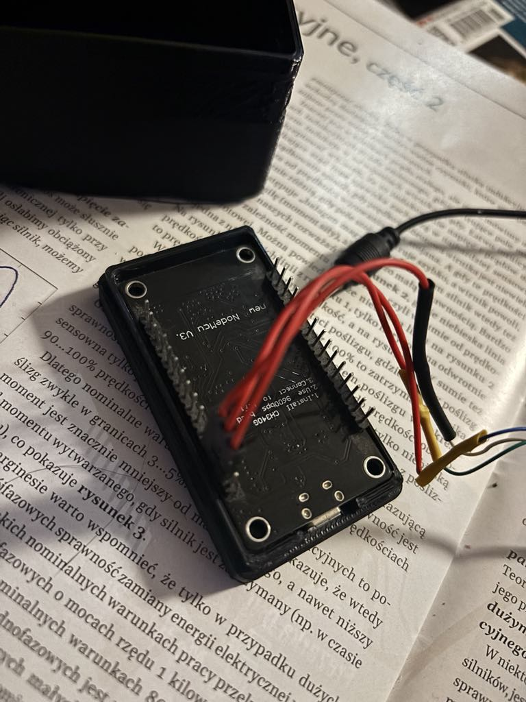
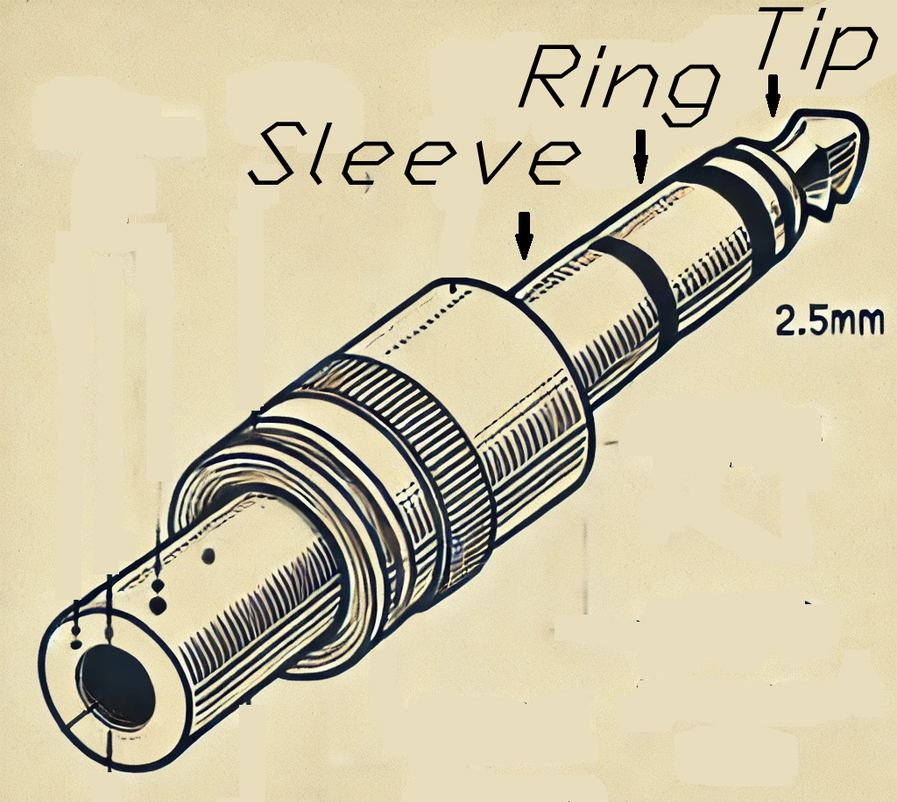

To establish communication between the ESP8266 microcontroller and the Texas Instruments TI-85 calculator, we need to consider several technical aspects. The TI-85 uses a serial port (RS232) for communication with a computer, so it will be necessary to connect this port to the ESP8266 microcontroller. Using this port, we will be able to transfer data between the calculator and the computer, with the ESP8266 acting as an interface.

**Assumptions**

1. **Communication using RS232**: The TI-85 uses the RS232 standard for serial communication with the computer.
2. **UART interface in ESP8266**: The ESP8266 is capable of UART (Universal Asynchronous Receiver/Transmitter) communication, which is compatible with RS232 with appropriate voltage levels.
3. **Data transfer**: We will read data from the calculator and then display it on the computer via a WiFi connection.

**What we will need:**

- **ESP8266**: A microcontroller with built-in WiFi, which will serve as an intermediary for communication.
- **RS232 to TTL conversion module** (e.g., MAX232) – because the ESP8266 uses TTL voltage levels (0V/3.3V), and the TI-85 uses RS232 voltage levels (-12V to +12V).
- **RS232 serial cable** – to connect the TI-85 to the converter.
- **WiFi connection** – to transfer data to the computer or an application on the computer.

**Wiring:**

1. **ESP8266 and RS232 to TTL converter**:

   2.5" Jack plug pinout with TX, RX, GND pins:

A 2.5" jack plug (TRS) has three main parts:

- Tip - First contact.
- Ring - Second contact.
- Sleeve - Third contact (longest).

Pinout:

- Tip: TX Pin (Transmission)
- Ring: RX Pin (Reception)
- Sleeve: GND Pin (Ground)



- The RS232 converter (MAX232) has two main pins: **`TX`** (transmission) and **`RX`** (reception).
- The **`TX`** pin of the converter is connected to the **`RX`** pin of the ESP8266.
- The **`RX`** pin of the converter is connected to the **`TX`** pin of the ESP8266.
- The GND pin of the converter is connected to the GND of the ESP8266.
- It is important to ensure correct voltage levels, as the ESP8266 operates at 3.3V, while RS232 uses voltage levels that require conversion.

2. **TI-85 and RS232 to TTL converter**:
- Connect the TI-85 serial port (often DB9) to the RS232 to TTL converter input.
- In this case, we are interested in the TX and RX lines, as well as ground (GND).

3. **ESP8266 and Computer**:
- The ESP8266 will act as a WiFi bridge, transmitting data from the TI-85 to the computer (e.g., using WebSockets, HTTP, or MQTT).

**Sample code for ESP8266 (Arduino IDE)**

This code assumes that we will transfer data from the TI-85 to the computer via the ESP8266. We use serial communication (UART) between the ESP8266 and the calculator, then transfer data over WiFi (e.g., to a web application on the computer).

```cpp
#include <ESP8266WiFi.h>

const char* ssid = "Your_SSID";
const char* password = "Your_Password";
WiFiServer server(80);

#define RX_PIN 3   // RX pin on ESP8266 (D3)
#define TX_PIN 1   // TX pin on ESP8266 (D10)

HardwareSerial mySerial(1);  // Using hardware serial port 1 on ESP8266

void setup() {
  Serial.begin(115200);  // Communication with the computer
  mySerial.begin(9600, SERIAL_8N1, RX_PIN, TX_PIN);  // Communication with TI-85 (9600 baud rate)
  WiFi.begin(ssid, password);

  while (WiFi.status() != WL_CONNECTED) {
    delay(500);
    Serial.print(".");
  }

  Serial.println("Connected to WiFi");
  server.begin();
}

void loop() {
  WiFiClient client = server.available();

  if (client) {
    Serial.println("New connection");
    while (client.connected()) {
      if (mySerial.available()) {
        char data = mySerial.read();  // Read data from TI-85
        client.write(data);  // Send data to client
        Serial.print(data);  // Print data to serial monitor
      }
    }
    client.stop();
    Serial.println("Connection closed");
  }

  // Sending data from computer to TI-85
  if (Serial.available()) {
    char data = Serial.read();  // Read data from serial port
    mySerial.write(data);  // Send data to TI-85
  }
}
```

**Explanation of operation:**

1. **WiFi**: The code connects to a WiFi network using the provided SSID and password.
2. **Serial communication**:
   - **mySerial** is the serial port used to communicate with the TI-85. We read data from the TI-85 and send it to the client (e.g., a web browser).
   - **Serial** is used to communicate with the computer, enabling commands to be sent to the TI-85.
3. **HTTP Server**: A simple HTTP server is started on port 80, which waits for client connections (e.g., a web browser).
4. **Data transfer**: Once a client connection is established, the ESP8266 receives data from the TI-85 and sends it to the client via WiFi. The data can be displayed on a webpage or received by a computer application.

**Summary:**

- **HardwareSerial mySerial** allows communication between the ESP8266 and the TI-85 via UART.
- **WiFiClient** enables data transmission to the computer via WiFi, allowing visualization of TI-85 data.
- The use of an HTTP server on the ESP8266 enables easy reception of data on the computer via a browser.

The code above is a foundation that can be expanded with additional features, such as file handling or advanced interactions with the TI-85 calculator.

To read data from the **TI-85** on the computer, you need to create an appropriate application or use an existing solution that allows communication via the serial port with the device. Below are two main methods:

1. **Using a serial terminal (e.g., PuTTY)**
2. **Writing a simple Python program to read data from the calculator**

Both methods can utilize the **ESP8266** as an intermediary in communication between the TI-85 calculator and the computer (via WiFi).

**1. Reading data using a serial terminal (e.g., PuTTY)**

If you just want to read data from the calculator on the computer without writing your own applications, the simplest solution is to use **PuTTY** or **Tera Term**, which allow you to connect to the serial port via WiFi (with the ESP8266 acting as a communication bridge).

**Steps:**

1. **Install PuTTY or Tera Term**:
   1. [Download PuTTY](https://www.putty.org/) or download Tera Term.
2. **Configure WiFi connection with ESP8266**:
   - Ensure that the ESP8266 is properly configured and connected to the WiFi network. It will transfer data from the TI-85 to the computer via WiFi, as in the previous example.
3. **Configure PuTTY/Tera Term for serial port connection**:
   - **ESP8266 IP address**: Open PuTTY and set the IP address of the ESP8266 and port (default is port 80 if using HTTP).
   - You can also configure PuTTY to connect to the serial port directly if you have a direct connection between the TI-85 calculator and the USB-RS232 converter.
4. **Open the connection**:
   - Once the connection with the ESP8266 (or directly with the device) is established, PuTTY/Tera Term should start receiving data from the calculator and display it on the computer screen.

**2. Reading data using a Python program**

If you want to create your own software to read data from the TI-85 calculator via the ESP8266, the best solution is to use **Python** and a library to handle serial communication, such as **pySerial**.

**Steps:**

1. **Install Python and the pySerial library**:
   - If you don’t have Python installed, download it from [the official site](https://www.python.org/downloads/).
   - Install the **`pySerial`** library, which enables serial communication:

```
pip install pyserial
```

2. **Create a simple Python program**:

   Below is an example Python script that reads data sent via the serial port from the TI-85 calculator through the ESP8266 (in this case, via WiFi, communication can happen through serial or HTTP, depending on ESP8266 configuration).

```python
import serial
import time

# Serial port settings (check which port is assigned to your device)
ser = serial.Serial('COM3', 9600, timeout=1)  # Change COM3 to the correct port (for Linux, it's e.g., /dev/ttyUSB0)
time

.sleep(2)  # wait for connection to establish

while True:
    if ser.in_waiting > 0:
        data = ser.readline().decode('ascii').strip()  # Read a line of data
        print(f"Received data: {data}")
```

This script opens a serial connection to the TI-85 calculator and prints the data received.

**Summary**:

- **Serial terminal (PuTTY/Tera Term)**: Simple and quick to set up for direct data reception.
- **Python program**: Provides more control over the data and can be customized for further data processing and integration.

**Conclusion**:

Using the ESP8266 to interface between the TI-85 calculator and the computer allows you to receive data from the TI-85 and display it on a computer via WiFi. The hardware connections are straightforward, and the software code provided in this example offers a functional starting point for your own system.

By using tools like PuTTY or a custom Python program, you can easily read and manage data sent from the TI-85 calculator, while the ESP8266 provides the necessary wireless communication bridge.
